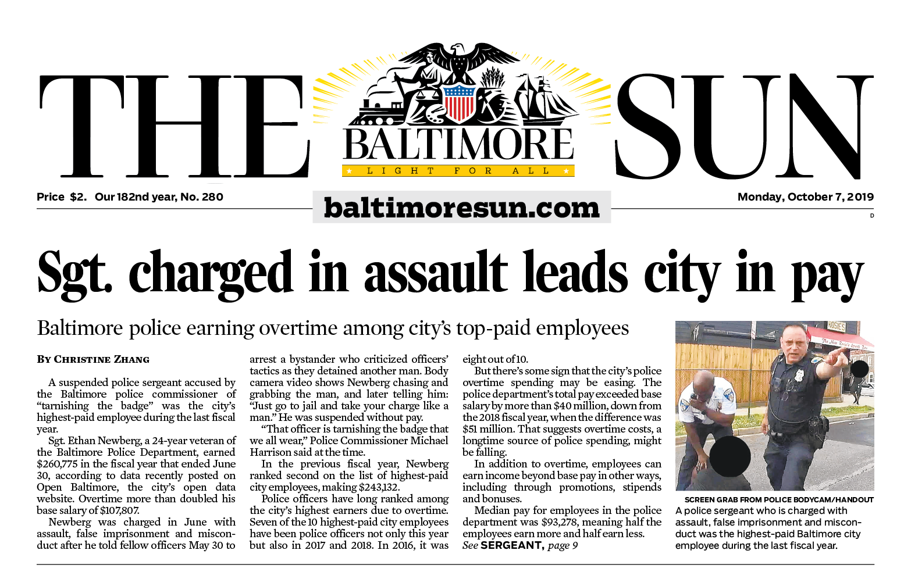

# Baltimore city salaries fiscal year 2019

## Baltimore Sun analysis

By [Christine Zhang](mailto:czhang@baltsun.com)

The Baltimore Sun analyzed the fiscal year 2019 city government salaries figures [recently posted](https://data.baltimorecity.gov/City-Government/Baltimore-City-Employee-Salaries-FY2019/6xv6-e66h/data) on Open Baltimore, the city's open data website. The analysis provided information for an October 7, 2019 Baltimore Sun story titled "Baltimore’s highest-paid city employee is police sergeant charged with assaulting bystander" (print headline: "Sgt. charged in assault leads city in pay.")

The Sun's findings and analysis are available in the "analysis" markdown file in this repository: [`analysis.md`](https://github.com/baltimore-sun-data/balt-city-salaries-2019/blob/master/analysis.md).

If you'd like to run the code yourself in R, you can download the R Markdown file [`analysis.Rmd`](https://github.com/baltimore-sun-data/balt-city-salaries-2019/blob/master/analysis.Rmd) along with the data in the [`input`](https://github.com/baltimore-sun-data/balt-city-salaries-2019/tree/master/input) folder.

https://twitter.com/baltsundata

## Community Contributions

There are many angles to explore with this data, beyond just the ones we looked into for our story. 

**Have something to contribute?** Send us a pull request or contact us on Twitter [@baltsundata](https://twitter.com/baltsundata) or via [email](mailto:czhang@baltsun.com).

You can also fork a copy of this repo to your own account.

## Licensing

All code in this repository is available under the [MIT License](https://opensource.org/licenses/MIT). The data files are available under the [Creative Commons Attribution 4.0 International](https://creativecommons.org/licenses/by/4.0/) (CC BY 4.0) license.